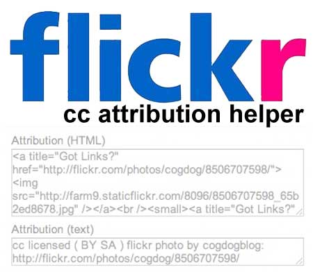
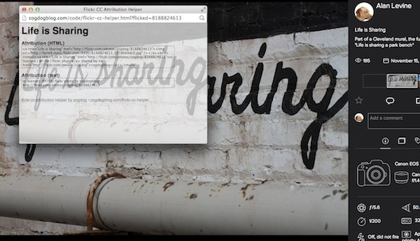

Flickr Creative Commons Attribution Helper
=========================
by Alan Levine http://cogdog.info/

ABOUT
-----
Darn you flickr! You make it so complex to give proper attribution for Creative Commons images. From 2009-2014, I made this possible via a Firefox Greasemonkey script / Google Chrome Extension which was dependent on parsing a flickr photo page content and inserting the cit and paste attribution with some XPATH mumbo jumbo.

But the "new" flickr design makes this totally impossible, and as a good nudge for this new approach. 

So the new method is triggered via a browser bookmarklet tool- install and whenever you are viewing a flickr photo licensed under creative commons, it will launch a small window with the one click copy/paste attribution fit for use in a blog post or a presentation.

Because attribution is love.

See http://cogdogblog.com/flickr-cc-helper for the sordid long history

To run your own version, you just need to put a simple HTML web page up that handles the lifting; the bookmarklet passes it the flickr image ID, the JavaScript code fetches the image info via the flickr JSON API, and presents you with the goodies

USING
-----
Just find a creative commons image photo you want to use (I love http://compfight.com/) ... like this one http://flickr.com/photos/cogdog/8188824613

Click your bookmarklet tool.

You should get something like 

This code allows you to set it up for your own use.

Requirements
------------

A place to put a HTML page at a public URL

You will need to get your own Flickr API key 

Setting Up
----------
1. Get a flickr API key https://www.flickr.com/services/apps/create/apply
2. Edit the  flickr-cc-helper.html to enter the API key value at

`// flickr api key. Get yer own at https://www.flickr.com/services/apps/create/apply
// Smoke will rise from your browser w/o this
var fpai = 'YOUR-OWN-APIKEY';`

3. Upload to your web server in directory of your choice.  Check the URL. You know how to do this?
4. Open the template script for the bookmarklet `bookmarklet.txt` 
5. Edit the value for `helperURL='http://yourown.domain.com/flickr-cc-helper.html';` for yours.
6. Copy line 2
7. In your web browser, open your bookmark editor/manager and create a new bookmark. Put the code into the address.
8. Attribute away

Yes This is Barebones
---------------------
I am working on a hosted version on github pages so all you need is the bookmarklet... and I will make a tol to generate the code, so it is drag and drop.

